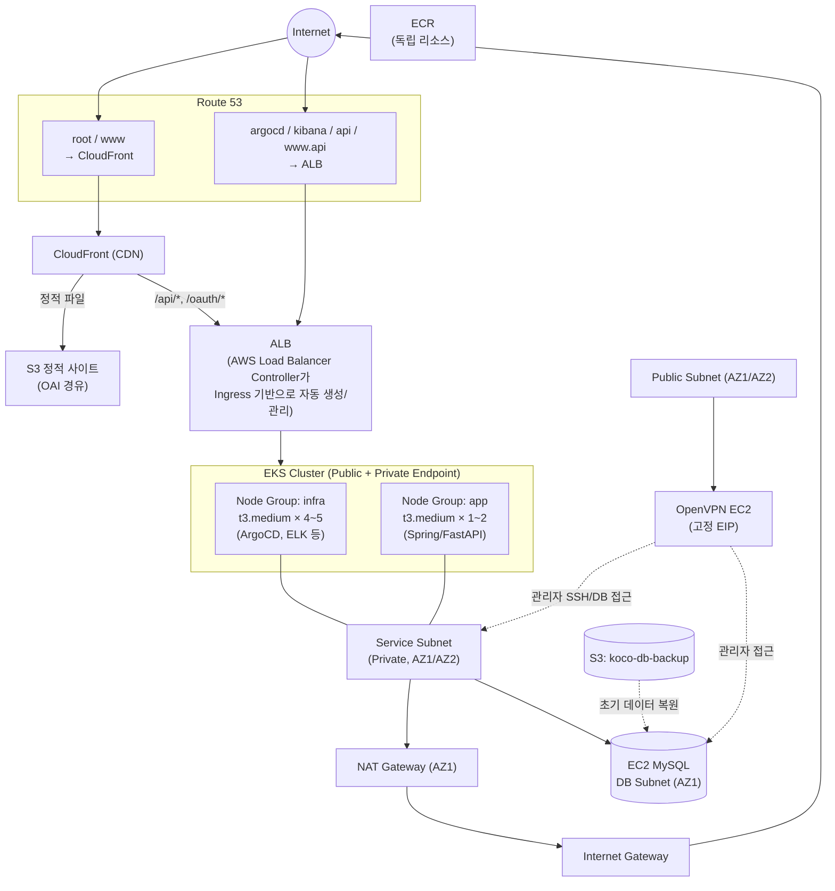

```
██╗  ██╗ ██████╗  ██████╗ ██████╗
██║ ██╔╝██╔═══██╗██╔════╝██╔═══██╗
█████╔╝ ██║   ██║██║     ██║   ██║
██╔═██╗ ██║   ██║██║     ██║   ██║
██║  ██╗╚██████╔╝╚██████╗╚██████╔╝
╚═╝  ╚═╝ ╚═════╝  ╚═════╝ ╚═════╝

  Terraform-based AWS EKS Infrastructure
```

# KOCO — Terraform 기반 AWS EKS 인프라

> Terraform으로 전체 라이프사이클을 관리하는 AWS EKS 인프라 프로젝트입니다. VPC부터 EKS 클러스터, IRSA 기반 IAM 연동, Helm(AWS Load Balancer Controller / ArgoCD), CloudFront + S3 정적 호스팅, ECR까지 — 하나의 코드베이스로 dev/prod 두 환경을 동일한 구조로 프로비저닝합니다.

---

## 목차

1. [전체 인프라 아키텍처](#전체-인프라-아키텍처)
2. [사용 AWS 서비스 및 도구](#사용-aws-서비스-및-도구)
3. [Terraform 모듈 구조](#terraform-모듈-구조)
4. [EKS 클러스터 구성](#eks-클러스터-구성)
5. [Helm 배포 구성](#helm-배포-구성)
6. [IAM 및 IRSA 설계](#iam-및-irsa-설계)
7. [네트워크 설계](#네트워크-설계)
8. [스토리지 및 CDN](#스토리지-및-cdn)
9. [데이터베이스](#데이터베이스)
10. [OpenVPN](#openvpn)
11. [ECR](#ecr)
12. [알려진 제약 사항](#알려진-제약-사항)
13. [실행 방법](#실행-방법)

---

## 전체 인프라 아키텍처



### 트래픽 흐름 요약

| 흐름 | 경로 |
|---|---|
| 정적 프론트엔드 | 사용자 → Route53 → CloudFront → S3(OAI) |
| API / 인증 | 사용자 → CloudFront(`/api/*`, `/oauth/*`, 무캐시) → ALB → EKS Ingress → app 노드그룹 |
| GitOps 대시보드 | 관리자 → Route53(`argocd.*`) → ALB → ArgoCD(ClusterIP + Ingress) |
| DB 접근 | app Pod → DB 서브넷의 MySQL EC2(3306) |
| 관리 접근 | 관리자 → OpenVPN EC2 → 프라이빗 서브넷 SSH/DB 직접 접근 |

---

## 사용 AWS 서비스 및 도구


| 항목 | 버전 |
|---|---|
| AWS Provider | `hashicorp/aws ~> 5.95.0` |
| Helm Provider | `hashicorp/helm ~> 2.13.0` |
| EKS 원격 모듈 | `terraform-aws-modules/eks/aws ~> 20.0` |
| EKS 클러스터 버전 | `1.32` |
| 리전 | `ap-northeast-2` |

---

## Terraform 모듈 구조

로컬 모듈 10종 + 환경별 root module(`environments/dev`, `environments/prod`)로 구성되어 있으며, dev/prod는 완전히 동일한 모듈 세트를 동일한 순서로 호출하고 변수 값(CIDR, 도메인, 리소스 네이밍)만 다릅니다.

| # | 모듈 | 역할 |
|---|---|---|
| 1 | `vpc` | VPC, 6개 서브넷(퍼블릭/서비스/DB×2AZ), IGW, NAT, 라우팅 테이블 |
| 2 | `security_group` | OpenVPN / EC2(Spring·FastAPI) / DB용 보안 그룹 |
| 3 | `openvpn` | 관리자 VPN 접근용 OpenVPN EC2 + 고정 EIP |
| 4 | `db_instance` | EC2 기반 MySQL 서버, S3 백업 복원 자동화 |
| 5 | `iam` | 노드그룹 IAM 역할 + ALB Controller/EBS CSI용 IRSA 역할 |
| 6 | `service_account` | ALB Controller용 Kubernetes ServiceAccount(IRSA 연동) |
| 7 | `helm` | AWS Load Balancer Controller + ArgoCD 배포, Route53 연동 |
| 8 | `s3_static_site` | 프론트엔드 정적 파일 호스팅(CloudFront OAI 전용 접근) |
| 9 | `cdn` | CloudFront 배포(S3 + ALB 듀얼 오리진) |
| 10 | `ecr` | 컨테이너 이미지 저장소 |

**원격 모듈**: `terraform-aws-modules/eks/aws ~>20.0`을 사용해 EKS 클러스터·노드그룹·OIDC Provider·애드온 생성을 위임하고, v20의 **Access Entry API**(`enable_cluster_creator_admin_permissions`)로 클러스터 접근 권한을 관리합니다(레거시 `aws_auth` ConfigMap 미사용).

> 클러스터/노드그룹/OIDC Provider를 직접 `aws_eks_cluster` 등 raw 리소스로 구현하는 대신 커뮤니티 표준 원격 모듈을 채택한 이유는, EKS 신규 기능(Access Entry API 등)이 공식 모듈에 가장 먼저 반영되고, 검증된 코드로 노드그룹/애드온 관리 보일러플레이트를 줄여 로컬 모듈(`iam`, `service_account`, `helm`)의 IRSA 연동 로직에 집중할 수 있기 때문입니다.

### 환경별(dev/prod) 구성 차이

dev/prod는 아래 표에 해당하는 변수 값만 다르고, 그 외 모듈 구조·EKS 스펙·애드온 구성은 완전히 동일합니다.

| 항목 | dev | prod |
|---|---|---|
| VPC CIDR | `10.110.0.0/16` | `10.120.0.0/16` |
| 도메인 | `koco-test.click` | `ktbkoco.com` |
| EKS 클러스터 이름 | `koco-dev-cluster` | `koco-prod-cluster` |
| S3 정적 사이트 버킷 | `dev-koco-front-s3` | `prod-koco-front-s3` |
| ECR 저장소 | `dev-ecr-repo` | `prod-ecr-repo` |

동일한 코드베이스로 두 환경을 재현 가능하게 유지하면서, 네트워크 대역과 리소스 네이밍만 환경 변수로 분리하는 전략입니다.

### 모듈 의존성 흐름

```
koco_vpc
  ├─→ security_group ─→ openvpn / db
  ├─→ eks (vpc_id, service subnet)
  └─→ helm (vpc_id)

eks (OIDC issuer / provider ARN)
  └─→ iam (IRSA 신뢰관계 구성) ←── sa (ServiceAccount 이름/네임스페이스)

helm (depends_on: vpc, eks, sa, iam)
  └─→ helm.alb_dns ─→ cdn (ALB API 오리진)

s3_static_site ⇄ cdn  (OAI ARN / 버킷 이름 상호 참조)
ecr : 독립 모듈
```

### State 관리

`koco/backend/` 모듈이 Terraform state용 S3 버킷(버저닝+SSE+퍼블릭 차단)과 DynamoDB 잠금 테이블을 부트스트랩하며, 각 환경의 `provider.tf`에서 `backend "s3"` 블록으로 원격 state를 참조합니다.

---

## EKS 클러스터 구성

```hcl
module "eks" {
  source  = "terraform-aws-modules/eks/aws"
  version = "~>20.0"

  cluster_name    = local.cluster_name   # koco-dev-cluster / koco-prod-cluster
  cluster_version = "1.32"

  cluster_endpoint_public_access  = true
  cluster_endpoint_private_access = true

  cluster_addons = {
    coredns                = { most_recent = true }
    kube-proxy             = { most_recent = true }
    vpc-cni                = { most_recent = true }
    eks-pod-identity-agent = { most_recent = true }
  }

  eks_managed_node_group_defaults = {
    ami_type     = "AL2023_x86_64_STANDARD"
    iam_role_arn = module.iam.eks_node_group_role_arn
  }

  eks_managed_node_groups = {
    infra = { instance_types = ["t3.medium"], min_size = 4, max_size = 5, desired_size = 4, disk_size = 30 }
    app   = { instance_types = ["t3.medium"], min_size = 1, max_size = 2, desired_size = 2, disk_size = 3  }
  }

  enable_cluster_creator_admin_permissions = true
}
```

### 노드 그룹 설계

| 노드그룹 | 용도 | 인스턴스 | min/max/desired | disk |
|---|---|---|---|---|
| `infra` | ArgoCD, ELK 등 인프라 워크로드 | t3.medium | 4/5/4 | 30GB |
| `app` | Spring/FastAPI 애플리케이션 워크로드 | t3.medium | 1/2/2 | 3GB |

인프라 워크로드와 애플리케이션 워크로드를 노드그룹 라벨(`node-group=infra`/`app`)로 분리해 스케줄링 관심사를 나누는 설계입니다. 두 노드그룹 모두 서비스(프라이빗) 서브넷 2개 AZ에 걸쳐 배치되어 기본적인 고가용성을 확보합니다.

dev/prod가 동일한 노드그룹 스펙을 쓰는 이유는 두 환경의 인프라 구조를 100% 동일하게 유지해, dev에서 검증한 배포·스케줄링 동작이 prod에서도 그대로 재현되도록 하기 위함입니다. 트래픽 규모에 따라 환경별로 노드 수/인스턴스 타입을 차등화하는 전략은 현재 범위 밖이며, 필요 시 `eks_managed_node_groups` 값만 환경 변수로 분리하면 됩니다.

### 클러스터 접근 관리

- v20의 **Access Entry API** 채택(`enable_cluster_creator_admin_permissions = true`) — 클러스터 생성자에게 자동으로 관리자 권한 부여.
- `enable_irsa` 기본값(`true`)으로 **OIDC Identity Provider**가 자동 생성되어 IRSA의 기반이 됩니다.

---

## Helm 배포 구성

`helm` 모듈이 EKS 클러스터 위에 두 개의 핵심 애드온을 Helm으로 배포합니다.

### AWS Load Balancer Controller

```hcl
resource "helm_release" "aws_load_balancer_controller" {
  name       = "aws-load-balancer-controller"
  namespace  = "kube-system"
  repository = "https://aws.github.io/eks-charts"
  chart      = "aws-load-balancer-controller"
  version    = "1.7.1"

  set { name = "clusterName" ; value = var.cluster_name }
  set { name = "region"      ; value = var.region }
  set { name = "vpcId"       ; value = var.vpc_id }
  set { name = "serviceAccount.create" ; value = "false" }
  set { name = "serviceAccount.name"   ; value = "aws-load-balancer-controller" }
}
```

- Kubernetes Ingress(`kubernetes.io/ingress.class: alb`) 리소스를 감시해 ALB를 자동으로 생성/관리합니다.
- `serviceAccount.create = false`로 별도 `service_account` 모듈이 미리 생성한 ServiceAccount를 재사용 — IAM Role과의 연동은 **IRSA(IAM Roles for Service Accounts)** 패턴을 통해 이루어지도록 설계되어 있습니다(자세한 내용은 [IAM 및 IRSA 설계](#iam-및-irsa-설계) 참고).

### ArgoCD

```hcl
resource "helm_release" "argocd" {
  name             = "argocd"
  namespace        = "argocd"
  repository       = "https://argoproj.github.io/argo-helm"
  chart            = "argo-cd"
  version          = "5.51.6"
  create_namespace = true

  set { name = "server.service.type"            ; value = "ClusterIP" }
  set { name = "server.extraArgs[0]"            ; value = "--insecure" }
  set { name = "configs.params.server.insecure" ; value = "true" }
}
```

- ArgoCD 서버는 `ClusterIP`로 클러스터 내부에만 노출하고, 별도의 `kubernetes_ingress_v1` 리소스(ALB Ingress, internet-facing)로 `argocd.<domain>` 경로를 통해 외부 접근을 제공합니다.
- ALB의 HTTPS(443) 리스너가 TLS 종료를 담당하고 ALB→Pod 구간은 `--insecure`(HTTP)로 통신 — TLS 종료를 로드밸런서에서 처리하는 일반적인 패턴입니다.
- ALB 생성 후 `data.aws_lbs`/`data.aws_lb`로 조회하여 Route53에 `argocd` / `kibana` / `api` / `www.api` 서브도메인 레코드를 자동 등록합니다.

**GitOps 워크플로우**: ArgoCD는 애플리케이션 매니페스트를 별도의 GitOps 전용 저장소인 [`kakaotech-21-iceT-gitops`](https://github.com/KIMSEOKWON00/kakaotech-21-iceT-gitops)를 Source of Truth로 두고 동기화합니다. 이 저장소(Terraform 인프라 저장소)는 EKS/ALB Controller/ArgoCD "플랫폼"을 프로비저닝하는 역할까지만 담당하고, 그 위에서 실행되는 애플리케이션의 배포 선언(Deployment/Service/Ingress 매니페스트 등)은 GitOps 저장소에서 별도로 관리하는 **인프라-애플리케이션 저장소 분리** 구조입니다.

---

## IAM 및 IRSA 설계

### IAM 역할 구성

| 역할 | 용도 | 신뢰 주체 |
|---|---|---|
| `eks-node-group-role` | EKS 노드그룹(EC2) 공유 역할 | `ec2.amazonaws.com` (`AmazonEKSWorkerNodePolicy` + `AmazonEBSCSIDriverPolicy`) |
| `alb-ingress-sa-role` | AWS Load Balancer Controller용 IRSA | OIDC Federated |
| `AmazonEKS_EBS_CSI_Driver_IRSA` | EBS CSI Driver용 IRSA | OIDC Federated |

### IRSA 동작 원리

```hcl
locals {
  oidc_url_without_https = replace(module.eks.cluster_oidc_issuer_url, "https://", "")
}

# IAM Role 신뢰 정책
Principal = { Federated = "<oidc-provider-arn>" }
Action    = "sts:AssumeRoleWithWebIdentity"
Condition = {
  StringEquals = {
    "<oidc_url>:aud" = "sts.amazonaws.com"
    "<oidc_url>:sub" = "system:serviceaccount:<namespace>:<sa_name>"
  }
}
```

EKS OIDC Identity Provider를 Federated 주체로 신뢰하고, `sub`/`aud` 조건으로 **특정 네임스페이스의 특정 ServiceAccount만** 해당 IAM Role을 assume할 수 있도록 제한하는 IRSA 표준 패턴을 적용했습니다. `cluster_oidc_issuer_url` → `iam` 모듈 → `service_account` 모듈로 이어지는 참조 체인을 통해 Terraform 모듈 간에 OIDC 신뢰 관계를 조립합니다.

> ⚠️ **현재 구현 상태**: 위 구조는 설계상 표준 IRSA 트러스트 패턴을 따르지만, 실제 코드에서는 `alb_ingress_sa_role`의 Federated 신뢰 주체 값과 ServiceAccount의 `eks.amazonaws.com/role-arn` 어노테이션 배선이 아직 끝까지 연결되어 있지 않아 IRSA 인증 체인이 완전히 동작하지는 않는 상태입니다. 자세한 내용과 개선 계획은 [알려진 제약 사항](#알려진-제약-사항)을 참고하세요.

### IAM 정책 설계

`alb-ingress-sa-role`에는 AWS 공식 **AWS Load Balancer Controller IAM Policy** 원문을 그대로 적용했습니다. SG/ALB/TargetGroup 관련 다수의 삭제·수정 액션에 `elbv2.k8s.aws/cluster` 리소스 태그 조건을 걸어, 컨트롤러가 직접 생성/관리하는 리소스로 권한 범위를 좁히는 AWS 권장 최소 권한 패턴을 따릅니다.

### 보안 설계 특징

- EKS 클러스터/노드그룹 접근은 Access Entry API로 관리해 레거시 `aws_auth` ConfigMap 운영 부담을 제거했습니다.
- DB 백업용 IAM 역할(`ec2_s3_access`)은 특정 S3 버킷(`koco-db-backup`)으로 리소스를 좁게 스코프해 최소 권한 원칙을 적용한 사례입니다.
- OpenVPN 인스턴스는 IAM 역할/인스턴스 프로파일을 아예 부여하지 않아, AWS API 접근 권한 없는 순수 VPN 게이트웨이로 동작하도록 설계했습니다.

---

## 네트워크 설계

### VPC 및 서브넷 구조

3계층(퍼블릭 / 서비스 / DB) × 2개 가용영역(`ap-northeast-2a`, `ap-northeast-2c`) = 총 6개 `/24` 서브넷으로 구성했습니다.

| 서브넷 | 용도 | 특성 |
|---|---|---|
| public-az1/az2 | OpenVPN, IGW 라우팅 | `map_public_ip_on_launch=true` |
| service-az1/az2 | EKS 노드그룹 배치 | 프라이빗, NAT 경유 아웃바운드 |
| db-az1/az2 | MySQL EC2 배치 | 프라이빗, NAT 경유 아웃바운드 |

### EKS 서브넷 태그 설계

| 서브넷 | 태그 | 의미 |
|---|---|---|
| public-az1/az2 | `kubernetes.io/role/elb=1` | 외부 ALB 후보 서브넷 |
| service-az1/az2 | `kubernetes.io/role/internal-elb=1` | 내부 LB 후보 서브넷 |

AWS Load Balancer Controller의 서브넷 자동탐색(subnet auto-discovery)이 정상 동작하도록, 퍼블릭/서비스 서브넷에 표준 EKS 태그 컨벤션을 적용했습니다.

### Security Group 계층 설계

```
sg_openvpn (0.0.0.0/0 → 22/443/1194/943)
   │
   ├─→ sg_ec2 : "Allow SSH from OpenVPN clients" (VPN을 통해서만 SSH 허용)
   │
   └─→ sg_db  : "Allow MySQL / SSH from VPN clients" (VPN을 통해서만 DB 관리 접근 허용)
```

OpenVPN을 유일한 관리 진입점으로 삼아, DB/EC2로의 SSH·관리 접근은 VPN을 경유해야만 가능하도록 보안 그룹을 계층화했습니다.

### 퍼블릭/프라이빗 분리

- EKS 클러스터와 데이터베이스는 프라이빗 서브넷에만 배치되어 인터넷에 직접 노출되지 않습니다.
- 아웃바운드 트래픽은 NAT Gateway를 경유하며, EKS 클러스터 엔드포인트는 Public/Private 접근을 모두 지원해 CI/CD와 사내망 양쪽에서의 접근을 허용합니다.

---

## 스토리지 및 CDN

프론트엔드 정적 파일은 S3 + CloudFront 조합으로, API/GitOps 트래픽은 ALB를 거쳐 같은 CloudFront 배포 안에서 경로 기반으로 통합됩니다.

### S3 정적 사이트 (`modules/s3_static_site`)

| 항목 | 설정 |
|---|---|
| 버킷명 | dev: `dev-koco-front-s3` / prod: `prod-koco-front-s3` |
| Public Access Block | 4개 옵션 모두 활성화 (퍼블릭 접근 완전 차단) |
| 접근 허용 | CloudFront Origin Access Identity(OAI)에게만 `s3:GetObject` 허용 |

버킷은 퍼블릭 웹사이트 엔드포인트가 아니라 **REST API 엔드포인트 + OAI** 방식으로만 CloudFront에서 접근 가능하도록 설계되어 있습니다.

### CloudFront (`modules/cdn`)

- **듀얼 오리진**: S3(정적 파일) + ALB(`/api/*`, `/oauth/*` 경로 — Spring/FastAPI, ArgoCD 등으로 라우팅)
- **경로 기반 캐싱**: `/api/*`, `/oauth/*`는 TTL 0(무캐시)으로 인증/API 요청이 항상 오리진까지 전달되도록 구성했고, 그 외 정적 자산은 기본 1시간/최대 24시간 캐시.
- **뷰어 HTTPS 강제**: 전체 behavior에서 `redirect-to-https` + `TLSv1.2_2021` 최소 프로토콜을 적용.
- Route 53 루트/`www` 도메인이 CloudFront에 alias 레코드로 연결됩니다.

> CloudFront↔ALB 구간의 오리진 프로토콜 등 세부 보안 설정은 [알려진 제약 사항](#알려진-제약-사항)을 참고하세요.

---

## 데이터베이스

애플리케이션 DB는 RDS가 아니라 **EC2 기반 자체 관리형 MySQL**(`modules/db_instance`)입니다.

| 항목 | 값 |
|---|---|
| 배치 | DB 서브넷(프라이빗, AZ1) 단일 인스턴스, 고정 프라이빗 IP |
| 초기 데이터 | 최초 부팅 시 `user_data`가 S3(`koco-db-backup`)에서 최신 백업 파일을 1회 복원 |
| 접근 제어 | OpenVPN 경유 관리 접근 + 애플리케이션(App 노드그룹) 접근으로 제한하는 SG 설계 |

RDS 대신 EC2를 선택한 이유는 인스턴스 세부 튜닝 자유도와 비용 절감이며, 그 대가로 Multi-AZ 자동 장애조치나 자동 스냅샷 같은 관리형 기능은 직접 구현해야 합니다. 현재는 초기 시딩 스크립트만 있고 주기적 백업 자동화는 없는 상태로, [알려진 제약 사항](#알려진-제약-사항)에 개선 과제로 남겨두었습니다.

---

## OpenVPN

관리자가 프라이빗 네트워크(EKS 노드/DB)에 접근하는 유일한 진입점으로 OpenVPN EC2(`modules/openvpn`)를 퍼블릭 서브넷에 배치했습니다.

| 항목 | 값 |
|---|---|
| 배치 | 퍼블릭 서브넷 + 고정 EIP |
| IAM | 인스턴스 프로파일 없음 — AWS API를 호출할 필요가 없는 순수 VPN 게이트웨이로 최소 권한 원칙을 적용 |
| SG | 22(SSH) / 443·1194(VPN 터널) / 943(관리 UI) |

`sg_ec2`/`sg_db`는 OpenVPN의 보안 그룹을 소스로 참조해, **VPN을 경유해야만 SSH/DB 관리 접근이 가능**하도록 설계되어 있습니다(네트워크 설계 섹션의 [Security Group 계층 설계](#security-group-계층-설계) 참고).

---

## ECR

컨테이너 이미지 저장소는 다른 모듈과 독립적으로 존재하며, CI/CD 파이프라인이 빌드한 이미지를 이곳에 push합니다.

| 항목 | 값 |
|---|---|
| 저장소명 | dev: `dev-ecr-repo` / prod: `prod-ecr-repo` |
| 이미지 스캔 | `scan_on_push = true` (푸시 시 자동 취약점 스캔) |

```bash
aws ecr get-login-password --region ap-northeast-2 \
  | docker login --username AWS --password-stdin <account-id>.dkr.ecr.ap-northeast-2.amazonaws.com

docker tag <image>:latest <account-id>.dkr.ecr.ap-northeast-2.amazonaws.com/dev-ecr-repo:latest
docker push <account-id>.dkr.ecr.ap-northeast-2.amazonaws.com/dev-ecr-repo:latest
```

---

## 알려진 제약 사항

내부 리뷰 과정에서 확인된, 실제 운영 전 반드시 검토가 필요한 지점을 투명하게 공유합니다.

| 영역 | 내용 | 상태 |
|---|---|---|
| IRSA (ALB Controller) | `alb_ingress_sa_role`의 OIDC 신뢰 정책과 ServiceAccount 어노테이션 배선이 아직 끝까지 연결되지 않아, 현재 코드만으로는 IRSA 인증 체인이 완전히 동작하지 않음 | 🔧 수정 예정 |
| EKS 노드 ↔ DB 보안 그룹 | `node_group_sg_id`가 빈 값으로 전달되어, 앱 노드그룹에서 DB로의 SG 기반 접근 허용 규칙이 실제로는 배선되어 있지 않음 | 🔧 수정 예정 |
| DB 백업 | 자동 백업/스냅샷이 없음 — 최초 부팅 시 S3에서 1회 복원(시딩)만 수행 | 🔧 개선 예정 |
| OpenVPN 초기 설정 | 부트스트랩 스크립트에 초기 자격증명이 하드코딩되어 있어 운영 전 교체가 필요 | 🔧 수정 예정 |
| NAT Gateway | AZ1에 단일 배치되어 있어 해당 AZ 장애 시 다른 AZ의 아웃바운드 인터넷이 영향받을 수 있음 | 🔧 개선 예정 |
| IAM 역할명 | `stage`로 파라미터화되어 있지 않아, 동일 계정에 dev/prod를 배포할 경우 이름 충돌 가능 | 🔧 개선 예정 |
| ECR Lifecycle Policy | 오래된 이미지를 정리하는 수명주기 정책이 없음 | 🔧 개선 예정 |

> ArgoCD와 GitOps 저장소([`kakaotech-21-iceT-gitops`](https://github.com/KIMSEOKWON00/kakaotech-21-iceT-gitops)) 연동 이후 실제로 어떤 애플리케이션(ELK 등)이 배포되는지는 별도 분석 후 이 문서에 반영할 예정입니다.

---

## 실행 방법

### 0) 사전 준비물 (필수)

이 코드는 특정 계정/도메인을 전제로 하므로, 그대로 `apply`하기 전에 아래 항목을 반드시 본인 환경에 맞게 준비·오버라이드해야 합니다.

| 항목 | 확인/준비 사항 |
|---|---|
| AWS 자격 증명 | `aws configure` 또는 환경변수로 대상 계정에 접근 가능한 자격 증명이 설정되어 있어야 함 |
| Route53 호스팅 영역 | `domain_name`(기본값 `koco-test.click`/`ktbkoco.com`)을 소유한 도메인으로 교체하고, 해당 도메인의 Route53 호스팅 영역을 미리 생성 |
| ACM 인증서 | `acm_certificate_arn` 변수의 기본값은 **빈 문자열(`""`)** 입니다. CloudFront/ALB HTTPS 리스너가 정상 동작하려면 위 도메인으로 발급받은 ACM 인증서 ARN을 `-var` 또는 `terraform.tfvars`로 반드시 지정해야 합니다 |
| Terraform state 백엔드 버킷명 | `koco/backend`가 생성하는 S3 버킷명(기본 `koco-terraformstate`)은 전 세계에서 유일해야 하므로, 이미 사용 중이라면 `bucket_name` 변수를 변경 |

### 1) Terraform state 백엔드(S3 + DynamoDB) 프로비저닝

```bash
cd koco/backend
terraform init
terraform plan
terraform apply
```

### 2) 환경별 인프라 배포 (dev 예시)

```bash
cd koco/environments/dev

terraform init
terraform plan
terraform apply
```

prod 환경도 동일한 순서로 `koco/environments/prod` 디렉터리에서 실행합니다.

```bash
cd koco/environments/prod
terraform init
terraform plan
terraform apply
```

> dev/prod는 동일한 모듈 구조를 사용하므로, 환경을 전환할 때는 디렉터리만 바꿔서 동일한 `init → plan → apply` 순서를 따르면 됩니다.

> ⚠️ **state key 충돌 주의**: 두 환경의 `backend "s3"` 블록은 `key = "./terraform.tfstate"`로 코드상 동일하게 고정되어 있습니다. dev/prod를 같은 state 버킷에 그대로 순서대로 `init`하면 두 환경이 같은 state 파일을 공유하게 될 위험이 있으므로, 반드시 `terraform init -backend-config="key=dev/terraform.tfstate"`(prod는 `key=prod/terraform.tfstate`) 형태로 키를 분리하거나 `terraform workspace`로 환경을 구분한 뒤 진행하세요.

### 3) 리소스 정리

```bash
terraform destroy
```

